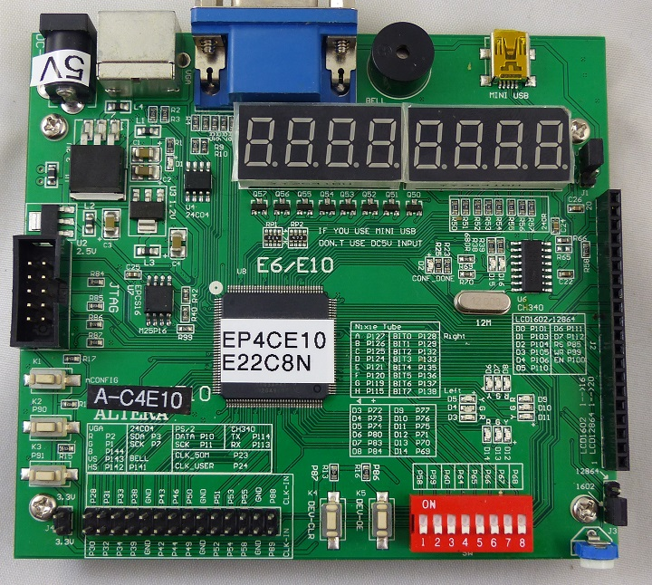
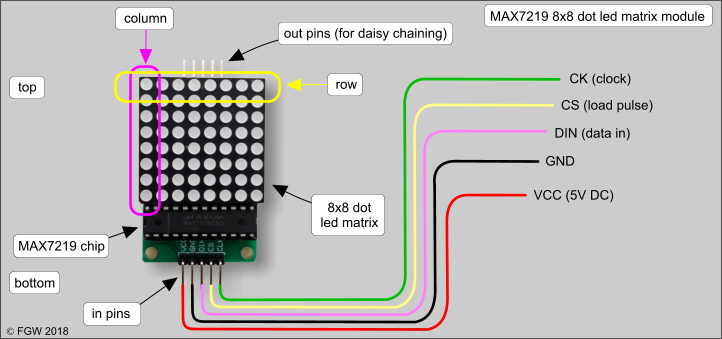
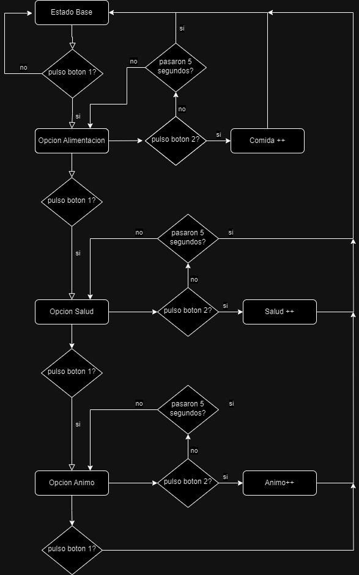
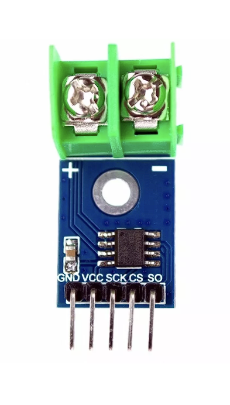

# Entrega 1 del proyecto WP01

* Juan Sebastián Otálora Quiroga 
* Natalia Álvarez Gallo

## Entrega definicion de Proyecto

Con las herramientas adquiridas en el transcurso del semestre, se busca el desarrollo de un proyecto final en verilog, que se sintetizara en la FPGA del grupo, ademas de la adicion de perifericos para obtener un funcionamiento especifico.

El tamagochi fue una pequeña mascota portatil la cual consistia en el cuidado de una mascota virtual, donde se debia controlar parametros tales como salud, limpieza, habitos de sueño y alimentacion. El fin de este proyecto es desarrollar una pequeña mascota portatil con el uso de modulos de verilog sintetizados en la FPGA Cyclone IV (EP4CE10E22C8N).

## Requerimientos

 * Una interfaz de usuario operada mediante botones físicos.
 * Al menos un sensor para ampliar las formas de interacción.
 * Un sistema de visualización para representar el estado actual y las necesidades de la mascota virtual.

## Especificaciones

A continuacion se describirá el hardware y su implementacion en el proyecto: 

### La mascota

Esta presentara cambios visuales en funcion de su estado que variara de manera binaria 

 * Animo
 * Salud
 * Hambre
 * Comodidad
 * Energia

 La visualizalizacion general cambiara dependiendo de la suma de los estados, 
  

### Visualizacion

Para la visualizacion de la mascota virtual, se considerara el uso de estados, es decirl por cada estado de la mascota se mostrara una "imagen" en pantalla, esta cambiara dependiendo de la suma de los estados que presente.

Esta se realizara con una pantalla de 8x8 leds con un modulo MAX7219, el cual plantea una comunicacion tipo SPI, siento el MAX7219 el esclavo y la GPGA el master de la comunicacion.

Donde se busca presentar las siguientes imagenes:

                        ___________________
                        | 0 0 0 0 0 0 0 0 |
                        | 0 0 0 0 0 0 0 0 |
                        | 0 0   0 0   0 0 |
    Patron 1            | 0 0 0 0 0 0 0 0 |
                        | 0   0 0 0 0   0 |
                        | 0 0         0 0 |
                        | 0 0 0 0 0 0 0 0 |
                        | 0 0 0 0 0 0 0 0 |
                        |-----------------|

                        ___________________
                        | 0 0 0 0 0 0 0 0 |
                        | 0 0 0 0 0 0 0 0 |
                        | 0 0   0 0   0 0 |
    Patron 2            | 0 0 0 0 0 0 0 0 |
                        | 0 0 0 0 0 0 0 0 |
                        | 0             0 |
                        | 0 0 0 0 0 0 0 0 |
                        | 0 0 0 0 0 0 0 0 |
                        |-----------------|

                        ___________________
                        | 0 0 0 0 0 0 0 0 |
                        | 0 0 0 0 0 0 0 0 |
                        | 0 0   0 0   0 0 |
    Patron 3            | 0 0 0 0 0 0 0 0 |
                        | 0 0 0 0 0 0 0 0 |
                        | 0 0         0 0 |
                        | 0   0 0 0 0   0 |
                        | 0 0 0 0 0 0 0 0 |
                        |-----------------|

El funcionamiento de la pantalla requiere un barrido, por lo cual imprecindible el uso de un divisor de frecuencia para poder tener una visualizacion "estatica" a la vista del ususario.

Resa nesesario el uso de reset para la presentacion de las imagenes ya que por cuestiones de sincronismo, la imagen puede verse dezplazada, esto planteara un punto de inicio en el mapeo de la imagen.

                          _______________
                         |               |
                clk -----|               |
                rst -----|               |
      data_in [7:0] -----|               |---- sclk
              start -----|               |---- mosi
     freq_div[15:0] -----|               |---- miso             data_out  [7:0] <----|               |---- cs
               busy <----|               |
              avail <----|               |
                         |_______________|

este modulo describe el funcionamiento de un maestro para la comunicación SPI, una forma común de enviar datos entre microcontroladores y dispositivos periféricos. Funciona con un reloj del sistema y una señal de reset para inicializarlo. Cuando se activa la señal de inicio (start), comienza una nueva transmisión. Durante la transmisión, se mueven los datos de entrada (data_in) a través de un registro de desplazamiento (shift_reg) y se envían uno a uno, contando los pulsos del reloj. Al mismo tiempo, se reciben datos desde el dispositivo conectado (miso) y se colocan en un registro de salida (data_out). Una vez que se han enviado y recibido todos los bits, se finaliza la transmisión y se indica que el módulo está ocupado (busy) hasta que esté listo para una nueva transmisión.

Este modulo se compartio por medio de  https://github.com/unal-edigital1/2024-1/blob/master/labs/buses/SPI/spi.md y este establece la vase de funcionamiento de la pntalla a implementar.

### Interaccion

Se usara un conjunto de 4 botones:

 RESET, que borrara los registros guardados durante la secion pasada de juego y reestablecera el disporitivo, en conjunto con la señal de CLK, al opimirlo por 5 segundos hara el proseso descrito.

 TEST, que sera un control maestro del dispositivo, se podra acceder a un cambio manual de los estados y manejo de vistas.

 Botones de interaccion, el boton 1 se encargara de navegar entre las caracteristicas de la mascota, es decir:

 

 

### Interaccion Automatica

Este hace referencia al comportamiento del tamagochi con estimulos externos, tomando la caracteristica de "comodidad", esta se sensara por medio de un sensor de temperatura, este es un conversor analogo digital, seria el modulo MAX6675, el cual tiene interfaz SPI, al igual que la pantalla, por lo que se realizara una a dicion al modulo SPI.

 

Se establecera la señal de temperatura de manera que si se superan los 20 grados celcius, o es inferior a 15, la temperatura no sera comoda, es decir el optimo es un margen de 5 grados entre 15 y 20 grados celcius.

### Uso de display 7 segmentos

En los displays 7 segmentos se mostrara la informacion de las estadisticas del tamagochi, ademas, se usara el punto de cada display para señalar el punto en el que se encuentre en el flujo del uso de pulsadores, es decir, si se encuentra ubicado en alimentar al tamagochi, el punto del display que muestra esta estadistica se encendera.

Los estados de cada una de las caracteristicas se mostraran como 1 si son buenas y 0 si son malas.

Ademas, los estados cambiaran en el transcurso del tiempo, con el paso del tiempo se desarrollara hambre, se bajara el animo y asi con las ddemas caracteristicas, se espera que esto sea a diferentes velocidades, por lo que es nesesario la implementacion de diferentes divisores de frecuencia para las diferentes caracteristicas, estos tiempos se encuentran pendientes por definir.